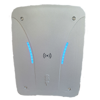

# ioBroker.echarge_cpu2

**Tests:** 

## echarge_cpu2 adapter for ioBroker

This adapter integrates the eCHARGE Hardy Barth eCHARGE cPµ2 - PRO Wallbox.
For more details please visit https://www.echarge.de/

## Supported devices

| Shelly Device | Type | Tested firmware version |
| ------------- | ---- | ----------------------- |
| cPμ2          | 1T11 | 1.84.50                 |
| cPμ2 Pro      | 1T11 | 1.84.50                 |

## Installation

You can install the adapter via the ioBroker web interface.

    1. Open your ioBroker web interface in a browser (eg: 192.168.1.30:8081)
    2. Click on Tab "Adapters"
    3. Type "echarge_cpu2" in the filter
    4. Click on the "+" symbol of the eCharge cPu2 adapter

## Configuration

Additional to the adapter installation you have to configure the adapter and add the Url of your Wallbox.

## Usage

## Changelog

<!--
	Placeholder for the next version (at the beginning of the line):
	### **WORK IN PROGRESS**
-->
### 0.0.7 (2023-05-24)

-   (MLembke) unused react in Admin removed

### 0.0.6 (2023-05-24)

-   (MLembke) Implemented a scheduled based checking the online state.
-   (MLembke) Updating the deviceinformation if the onlinestate changes to true.
-   (MLembke) Implemented a scheduled based checking of the CP state if the onlinestate is true.
-   (MLembke) Corrections done to become an ioBroker.repository member.

### 0.0.5 (2023-05-18)

-   (MLembke) README Text changed. Logo added.

### 0.0.4 (2023-05-17)

-   (MLembke) release workflow to npm finished

### 0.0.3 (2023-05-16)

-   (MLembke) initial release

## License

MIT License

Copyright (c) 2023 MLembke <m.lembke@lembke-it-service.de>

Permission is hereby granted, free of charge, to any person obtaining a copy
of this software and associated documentation files (the "Software"), to deal
in the Software without restriction, including without limitation the rights
to use, copy, modify, merge, publish, distribute, sublicense, and/or sell
copies of the Software, and to permit persons to whom the Software is
furnished to do so, subject to the following conditions:

The above copyright notice and this permission notice shall be included in all
copies or substantial portions of the Software.

THE SOFTWARE IS PROVIDED "AS IS", WITHOUT WARRANTY OF ANY KIND, EXPRESS OR
IMPLIED, INCLUDING BUT NOT LIMITED TO THE WARRANTIES OF MERCHANTABILITY,
FITNESS FOR A PARTICULAR PURPOSE AND NONINFRINGEMENT. IN NO EVENT SHALL THE
AUTHORS OR COPYRIGHT HOLDERS BE LIABLE FOR ANY CLAIM, DAMAGES OR OTHER
LIABILITY, WHETHER IN AN ACTION OF CONTRACT, TORT OR OTHERWISE, ARISING FROM,
OUT OF OR IN CONNECTION WITH THE SOFTWARE OR THE USE OR OTHER DEALINGS IN THE
SOFTWARE.
